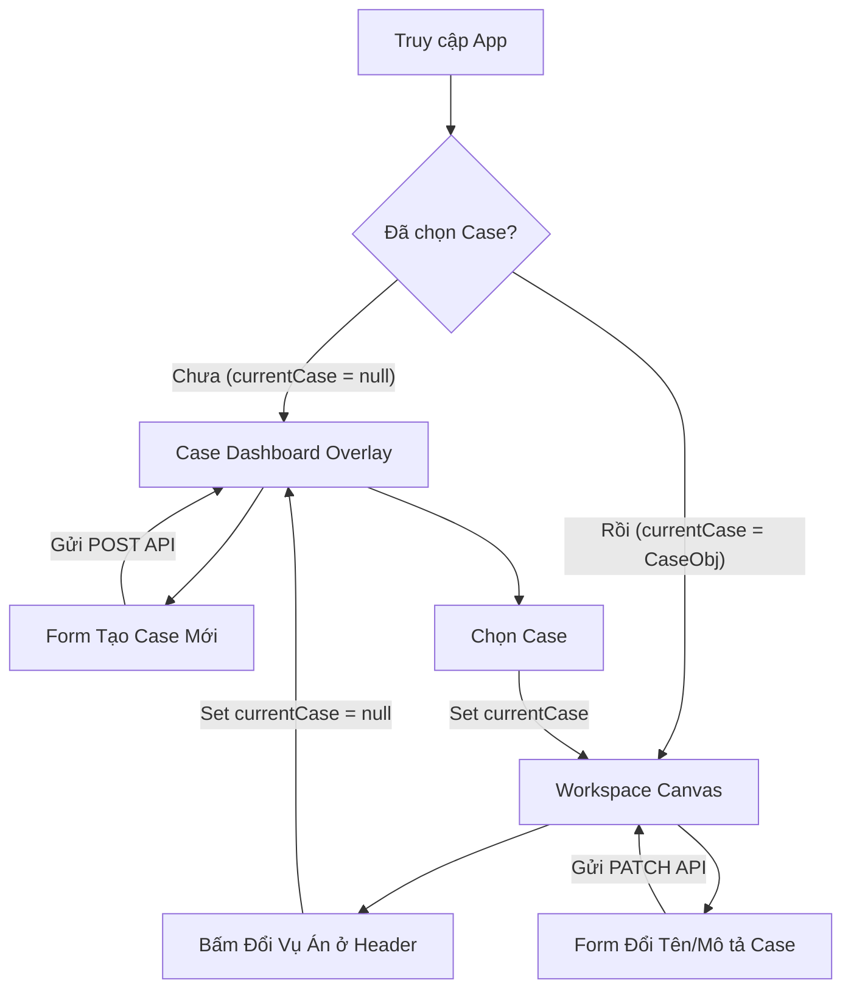

# Thiết kế Giao diện Người dùng (Frontend Design Decisions)

Tài liệu này ghi nhận toàn bộ các quyết định thiết kế giao diện, luồng tương tác người dùng (UX) và kiến trúc trạng thái (State Management) ở phía Frontend của ứng dụng Nexus Link Analysis.

---

## 1. Triết lý Thiết kế & Thẩm mỹ (Design Philosophy)

* **Phong cách Dark Mode Cao cấp**: Sử dụng tông màu nền siêu tối `#07080a` kết hợp với lưới tọa độ đồ thị (`graph-grid` mờ 20%) tạo chiều sâu và cảm giác công nghệ cao (Cyberpunk/Intelligence Agency style).
* **Typography**: Sử dụng font chữ không chân hiện đại (Sans-serif / Inter / System UI font) với màu chữ có độ tương phản phân cấp rõ ràng (Slate-200 cho nội dung thường, Slate-100/White cho tiêu đề quan trọng, Slate-500 cho thông tin phụ).
* **Hiệu ứng Glassmorphism & Glow**: Tận dụng tối đa các lớp nền mờ (`backdrop-blur-md`), viền mờ (`border-slate-800/80`) kết hợp với hiệu ứng đổ bóng phát sáng (`glow/shadow`) để làm nổi bật các thành phần UI điều khiển nằm trên Canvas đồ thị.
* **Micro-interactions (Tương tác nhỏ mượt mà)**: Các nút bấm, thẻ vụ án, ô tìm kiếm đều hỗ trợ hiệu ứng chuyển đổi trạng thái (`transition-all duration-200`) khi hover hoặc focus.

---

## 2. Thiết kế Hiện tại (Các tính năng đã triển khai)

### 2.1. Bản đồ mạng lưới (Network Graph Canvas)
* **Công nghệ**: Sử dụng **Cytoscape.js** dựng trên HTML5 Canvas 2D, cho phép hiển thị hàng ngàn node mượt mà.
* **Layout**: Sử dụng thuật toán bố cục lực học tự động **Force-directed layout (`cose`)** để tự động phân tán các node tránh chồng chéo lên nhau khi vừa tải.
* **Điều hướng**: Hỗ trợ đầy đủ Zoom in/out, kéo di chuyển màn hình (Pan) và kéo thả các node riêng lẻ để sắp xếp thủ công.

### 2.2. Cơ chế Chọn & Quản lý Trạng thái Selection
* **Đặc thù kỹ thuật (Debounce Event)**: Cytoscape bắn ra rất nhiều sự kiện đồng thời khi quét chuột chọn nhiều node. Để tránh nghẽn luồng xử lý giao diện (UI Thread) dẫn đến treo chuột, ứng dụng cài đặt cơ chế **Debounce 0ms (setTimeout)** trong hook `useCytoscape`. Cơ chế này chờ toàn bộ luồng sự kiện Cytoscape lắng xuống mới cập nhật trạng thái lên React State.
* **Nhấp đơn (Single Selection)**: Khi click vào 1 Node hoặc 1 Edge, mở bảng thông tin chi tiết (`PropertyPanel`). Vị trí của bảng được tính toán động dựa trên tọa độ thực của đối tượng trên màn hình.
* **Hủy chọn (Deselect)**: Click ra khoảng trống hoặc chọn nhiều đối tượng cùng lúc sẽ đóng bảng `PropertyPanel`.

### 2.3. Bộ lọc tìm kiếm nhanh (Search & Highlight)
* **Cơ chế**: Người dùng nhập chuỗi tìm kiếm vào thanh công cụ ở Header.
* **Hiệu ứng**:
  * Các node/edge khớp từ khóa sẽ được highlight (giữ nguyên màu sắc hoặc tăng sáng).
  * Các node/edge không khớp sẽ bị làm mờ đi (`fade out` bằng cách giảm độ mờ `opacity`), giúp người dùng tập trung ngay vào vùng thông tin quan trọng mà không làm mất ngữ cảnh xung quanh.

---

## 3. Thiết kế Mới: Quản lý Vụ án (Workspace & Case Management)

Để hỗ trợ việc chuyển đổi và quản lý giữa các Vụ án (Cases), hệ thống sử dụng mô hình **Hai chế độ màn hình (Two-mode UI State)** được quyết định bởi State: `currentCase` (giá trị có thể là `null` hoặc đối tượng `Case`).

### 3.1. Chế độ 1: Màn hình Dashboard chọn Vụ án (Case Selector Dashboard)
Hiển thị khi `currentCase === null`. Đây là một giao diện phủ toàn màn hình mang tính thẩm mỹ cao:
* **Grid Vụ án (Case Cards Grid)**:
  * Hiển thị danh sách vụ án dưới dạng các thẻ (Cards) với hiệu ứng bóng gương (`glassmorphism`).
  * Hover hiệu ứng: Thẻ hơi phóng to (`scale-102`), viền chuyển màu sáng (`border-blue-500`), đổ bóng phát sáng xanh nhạt.
  * Mỗi card hiển thị: Tên vụ án, Mô tả ngắn (hỗ trợ cắt chữ nếu quá dài), ngày tạo (`createdAt`), và nhóm nút thao tác:
    * **Mở vụ án (Open)**: Nút chính, click vào sẽ set `currentCase` và chuyển sang màn hình làm việc.
    * **Chỉnh sửa (Edit)**: Mở dialog sửa nhanh Tên và Mô tả.
    * **Xóa (Delete)**: Nút cảnh báo màu đỏ, yêu cầu xác nhận trước khi thực hiện xóa vĩnh viễn trên database.
* **Nút Tạo Vụ án Mới (Create Case Button)**:
  * Nằm ở vị trí dễ quan sát trên Dashboard. Khi bấm, hiển thị Form dạng Modal gồm:
    * Tên vụ án (Bắt buộc).
    * Mô tả vụ án.
    * Checkbox: **"Khởi tạo kèm dữ liệu đồ thị mẫu (Demo Data)"** - Bật mặc định. Nếu bật, backend sẽ tự động nạp tập node/edge demo cho vụ án mới này.

### 3.2. Chế độ 2: Màn hình Làm việc (Workspace Graph View)
Hiển thị khi đã có một vụ án được chọn (`currentCase !== null`).
* **Cải tiến Header**:
  * Góc trái: Hiển thị `NEXUS LINK ANALYSIS`. Ngay bên cạnh là tên vụ án đang chọn: `Vụ án: [Tên vụ án]`.
  * Có nút **Đổi Vụ án (Switch Case)** (icon Folder hoặc Arrow-left) để quay lại màn hình Dashboard (set `currentCase = null`).
  * Có nút **Chỉnh sửa nhanh (Edit Case Info)** để cập nhật tiêu đề/mô tả mà không cần thoát ra ngoài Dashboard.
* **Cơ chế Tải Đồ thị động (Dynamic Graph Reloading)**:
  * Hook `useGraphData(caseId)` lắng nghe sự thay đổi của `caseId` để fetch API `/api/cases/{caseId}/graph`.
  * Khi đổi vụ án, thực thể Cytoscape cũ sẽ được hủy (`cyInstance.destroy()`), và một đối tượng đồ thị mới được dựng lại tương ứng với dữ liệu của vụ án mới.
* **Trạng thái Vụ án Rỗng (Empty State Canvas)**:
  * Nếu dữ liệu đồ thị trả về trống rỗng (không có node nào), một overlay mờ nhẹ sẽ hiện lên giữa Canvas với thông tin: *"Vụ án chưa có dữ liệu mạng lưới. Vui lòng bấm nạp dữ liệu mẫu hoặc sử dụng chức năng nhập tập tin."* giúp trải nghiệm người dùng không bị hụt hẫng.
