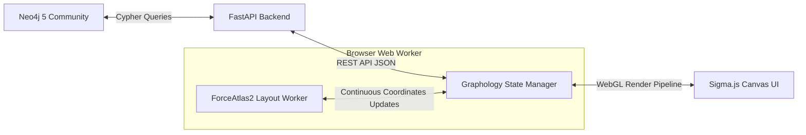

# Báo Cáo Đánh Giá Định Hướng Dự Án: Graph Link Analysis App

Báo cáo này đánh giá định hướng kiến trúc hiện tại của dự án [graph-link-analysis-app](file:///d:/dev/graph-link-analysis-app) dựa trên các nghiên cứu từ dự án mã nguồn mở [OGI (OpenGraph Intel)](file:///d:/dev/ogi), quy trình đánh giá tính phù hợp nghiệp vụ điều tra hình sự/OSINT thực tế, và yêu cầu hiệu năng xử lý đồ thị quy mô lớn.

---

## 1. So Sánh Tổng Quan Kiến Trúc (Architecture Comparison)

Bảng dưới đây so sánh sự khác biệt cốt lõi giữa hai dự án:

| Tiêu chí | OpenGraph Intel (OGI) | Graph Link Analysis App | Nhận định & Đánh giá |
| :--- | :--- | :--- | :--- |
| **Cơ sở dữ liệu** | Relational Database (PostgreSQL / SQLite) | Native Graph Database (Neo4j 5 Community) | **Neo4j vượt trội** trong các truy vấn duyệt đồ thị đa tầng (n-hops), tìm đường đi ngắn nhất (Shortest Path) và chạy thuật toán phân tích mạng lưới. |
| **Phân tách Vụ án** | Isolated DB Files / `project_id` scoping | `caseId` property scoping on a single DB | Hướng tiếp cận của cả hai đều phù hợp với các phiên bản Community/Local. Tuy nhiên, Neo4j giúp dễ dàng thực hiện liên kết chéo hơn. |
| **Thư viện Canvas** | **Sigma.js** (WebGL-based) | **Cytoscape.js** (2D Canvas-based) | **Cần thay đổi.** OGI phù hợp với đồ thị quy mô lớn (5,000+ nodes) nhờ WebGL. Dự án hiện tại dùng Cytoscape.js sẽ bị nghẽn hiệu năng nghiêm trọng khi đạt quy mô 10,000 nodes / 30,000 edges. |
| **Tính toán Centrality** | Đồng bộ (FastAPI request thread) -> **Bottleneck** | Chưa cài đặt (Định hướng: Neo4j GDS / Cypher) | Tận dụng Neo4j GDS sẽ giúp chúng ta tránh được lỗi nghẽn luồng API mà OGI đang gặp phải. |
| **Thuật toán Layout** | Đồng bộ trên Main Thread -> **Bottleneck** | Đồng bộ trên Client-side (`cose` layout) | Cả hai đều cần được nâng cấp lên chạy bất động bộ (Web Workers) để tránh đóng băng giao diện khi xử lý đồ thị lớn. |
| **Phân tích nâng cao** | BFS Components | Chưa cài đặt (Định hướng: Louvain, Dijkstra...) | Neo4j hỗ trợ sẵn Louvain, Dijkstra, PageRank trực tiếp thông qua Cypher và GDS, giảm tải viết code giải thuật trên Backend. |

---

## 2. Đánh Giá Khách Quan: Quyết Định Thay Thế Cytoscape.js Bằng Sigma.js / Graphology

Với định hướng nghiệp vụ yêu cầu quy mô tối thiểu **10,000 nodes và 30,000 edges**, chúng ta thực hiện đánh giá khách quan về việc thay đổi engine đồ thị từ Cytoscape.js sang Sigma.js/Graphology.

### 2.1. Đánh giá Hiệu năng ở Quy mô Mục tiêu (10k Nodes / 30k Edges)

* **Cytoscape.js (HTML5 Canvas 2D)**:
  * **Cơ chế**: Vẽ tất cả node và edge bằng CPU thông qua ngữ cảnh Canvas 2D. 
  * **Hành vi ở quy mô lớn**: Khi số lượng phần tử vượt quá 2,000, CPU bắt đầu bị quá tải để tính toán redraw mỗi khi người dùng zoom/pan. Ở mức 10,000 nodes và 30,000 edges, FPS sẽ tụt xuống dưới 1-2 FPS (hầu như đóng băng hoàn toàn). Các thao tác kéo thả node hoặc quét chọn vùng (box selection) sẽ có độ trễ cực lớn, dẫn đến crash tab trình duyệt.
  * **Kết luận**: **Hoàn toàn không khả thi** cho mục tiêu 10k nodes/30k edges.
* **Sigma.js + Graphology (WebGL)**:
  * **Cơ chế**: Ủy thác toàn bộ việc tính toán hiển thị và vẽ các node/edge cho GPU thông qua WebGL shaders. CPU chỉ quản lý cấu trúc dữ liệu đồ thị (`graphology`).
  * **Hành vi ở quy mô lớn**: Có thể render mượt mà ở mức 50,000+ nodes và 100,000+ edges duy trì ở mức 60 FPS. Các thao tác zoom/pan diễn ra trơn tru do GPU xử lý ma trận chuyển đổi hình học cực nhanh.
  * **Kết luận**: **Bắt buộc phải sử dụng** WebGL (như Sigma.js) để đáp ứng quy mô này.

---

### 2.2. Ma trận Trade-offs (Bảng so sánh chi tiết)

| Tiêu chí đánh giá | Cytoscape.js (2D Canvas) | Sigma.js / Graphology (WebGL) | Nhận định |
| :--- | :--- | :--- | :--- |
| **Giới hạn Render** | ~2,000 nodes (Lag nặng nếu cao hơn) | 100,000+ nodes (Mượt mà 60 FPS) | **Sigma.js thắng tuyệt đối** về hiệu năng thô. |
| **Khả năng Tương tác & Vẽ tay** | **Rất tốt**: Hỗ trợ kéo thả vẽ edge, tạo node mới trực quan từ UI cực kỳ đơn giản. | **Hạn chế**: Mặc định là thư viện Read-only/Explore. Muốn hỗ trợ vẽ edge/thêm node phải tự bắt tọa độ WebGL và vẽ thêm các lớp overlay. | Tương tác chỉnh sửa thủ công trên Sigma.js đòi hỏi nhiều công sức lập trình hơn. |
| **Styling & Custom Node** | **Dễ dàng**: Cú pháp CSS-like phong phú, vẽ node theo hình thù, badges, icons, border động dễ dàng. | **Phức tạp**: Cần viết thêm Custom Shaders (WebGL) nếu muốn hiển thị icons, badges hoặc viền node đặc thù. | Phát triển giao diện chi tiết cho Sigma.js sẽ tốn nhiều thời gian hơn. |
| **Visual Grouping (Compound Nodes)** | **Hỗ trợ Native**: Có tính năng node cha chứa node con, rất phù hợp để gom nhóm/phân cụm. | **Không hỗ trợ**: Phải tự cài đặt giải thuật "Collapse/Expand" bằng cách thay đổi cấu trúc dữ liệu đồ thị thủ công. | Cytoscape.js dễ làm tính năng phân cụm trực quan hơn. |
| **Layout Off-thread (Web Workers)** | Phức tạp (Cần cấu hình plugin ngoài như `cytoscape-cola` chạy worker). | **Hỗ trợ Native**: `graphology-layout-forceatlas2` tích hợp sẵn module Web Worker chạy ngầm rất tốt. | Sigma.js an toàn hơn cho luồng xử lý UI của trình duyệt. |

---

### 2.3. Đánh giá Độ phù hợp ở Giai đoạn Hiện tại (Suitability at Current MVP Stage)

Việc chuyển đổi công nghệ ở giai đoạn hiện tại mang cả cơ hội và rủi ro lớn đối với tiến độ dự án:

#### Kịch bản A: Giữ Cytoscape.js cho MVP, đổi sau
* **Ưu điểm**: Tiến độ hoàn thành các tính năng MVP (Workspace, Search, Properties Panel) sẽ rất nhanh vì Cytoscape.js cực kỳ dễ code và đã có sẵn khung code hoạt động.
* **Nhược điểm**: Sẽ tích tụ **nợ kỹ thuật (technical debt)** khổng lồ. Toàn bộ logic styling, event handling, logic vẽ đè tọa độ của panel, và các tính năng tương tác được viết cho Cytoscape sẽ phải đập đi xây lại hoàn toàn khi chuyển sang Sigma.js. 

#### Kịch bản B: Chuyển sang Sigma.js / Graphology NGAY BÂY GIỜ (Khuyên dùng)
* **Ưu điểm**: Thiết lập nền móng kiến trúc chuẩn ngay từ đầu. Mọi tính năng vẽ thêm node, styling, và layout off-thread sẽ được thiết kế trực tiếp trên mô hình WebGL/Graphology, loại bỏ việc tái cấu trúc mã nguồn tốn kém sau này.
* **Nhược điểm**: Tốc độ phát triển tính năng ban đầu sẽ chậm lại khoảng 30-40% do độ phức tạp của WebGL APIs và việc thiếu các tính năng tương tác chỉnh sửa đồ thị sẵn có của Sigma.js.

> [!IMPORTANT]
> **QUYẾT ĐỊNH CHIẾN LƯỢC**:
> Vì mục tiêu hiệu năng **10,000 nodes và 30,000 edges là một yêu cầu cứng**, chúng ta nên **thực hiện chuyển đổi sang Sigma.js / Graphology ngay từ giai đoạn hiện tại** trước khi đắp thêm các logic phức tạp như bộ lọc nâng cao, tìm đường đi ngắn nhất, hay quản lý Workspace sâu hơn. 
> Việc này đảm bảo tính bền vững của kiến trúc và tránh lãng phí công sức phát triển trên một thư viện chắc chắn sẽ bị loại bỏ khi đưa vào sử dụng thực tế.

---

## 3. Kiến trúc Đồ thị & Giải thuật với Neo4j và Sigma.js

Khi kết hợp **Neo4j** ở Backend và **Sigma.js** ở Frontend, chúng ta sẽ có một kiến trúc mạnh mẽ và phân tách rõ ràng nhiệm vụ:

### 3.1. Phân chia vai trò
1. **Neo4j**: Đóng vai trò là single source of truth về dữ liệu quan hệ, chịu trách nhiệm lưu trữ và chạy thuật toán nặng (Dijkstra shortest path, Louvain clustering) thông qua Neo4j GDS.
2. **FastAPI**: Trung chuyển dữ liệu dưới dạng JSON nhẹ, không thực hiện các phép toán đồ thị phức tạp để tránh nghẽn thread.
3. **Graphology (Frontend)**: Đóng vai trò là Graph Client trong trình duyệt, quản lý cấu trúc dữ liệu đồ thị và giao tiếp với Web Worker để tính toán tọa độ Layout.
4. **Sigma.js (Frontend)**: Nhận dữ liệu tọa độ từ Graphology và render trực tiếp lên GPU.

---

## 4. Lộ trình Triển khai Đề xuất Mới (Updated Roadmap)

Để thực hiện chuyển đổi mượt mà sang Sigma.js, lộ trình phát triển được điều chỉnh lại như sau:

### Giai đoạn 1: Di chuyển Engine đồ thị & Layout Worker (Ưu tiên Cao)
1. **Thay thế Dependency**: Gỡ bỏ `cytoscape` trong [package.json](file:///d:/dev/graph-link-analysis-app/frontend/package.json) và cài đặt `sigma`, `graphology`, `graphology-layout-forceatlas2`.
2. **Xây dựng NetworkGraph mới**: Viết lại component [NetworkGraph.jsx](file:///d:/dev/graph-link-analysis-app/frontend/src/features/graph/components/NetworkGraph.jsx) để khởi tạo Sigma.js thay vì Cytoscape.js.
3. **Cấu hình Layout Off-thread**: Sử dụng Web Worker đi kèm của `graphology-layout-forceatlas2` để tính toán vị trí node bất đồng bộ ngay khi load đồ thị từ Neo4j.
4. **Đồng bộ tọa độ**: Thiết lập cơ chế lưu tọa độ node (`x`, `y`) vào Neo4j khi kết thúc quá trình tính toán layout tự động hoặc kéo thả.

### Giai đoạn 2: Tái lập tính năng Tương tác & Nghiệp vụ (Ưu tiên Trung bình)
1. **Interactive Event Mapping**: Bắt các sự kiện click, hover, drag node của Sigma.js để mở `PropertyPanel` động.
2. **Manual Node/Edge Creation**: Xây dựng tool overlay trên Canvas để hỗ trợ thêm node và vẽ link thủ công bằng cách chuyển đổi tọa độ chuột sang tọa độ WebGL của Sigma.js.
3. **Cross-Case Linkage Alerts**: Tận dụng Neo4j để phát hiện trùng lặp thực thể chéo vụ án và hiển thị cảnh báo lên UI.
4. **Temporal filtering**: Lọc đồ thị thời gian thực theo thuộc tính thực tế `observed_at` của thực thể.

### Giai đoạn 3: Phân tích & Tối ưu hiển thị (Ưu tiên Thấp)
1. **Group Collapse/Expand**: Viết logic ẩn/hiện và gom nhóm các node thuộc cùng một community (phát hiện bởi Louvain GDS) thành một super-node ảo trong Graphology.
2. **Level-of-Detail (LoD) Styling**: Cấu hình ẩn nhãn text, thu nhỏ kích thước edge khi zoom out xa để tăng hiệu năng render tối đa lên mức 30,000+ edges.
3. **Manual Action Audit Logging**: Ghi nhật ký các chỉnh sửa bằng tay của điều tra viên.
